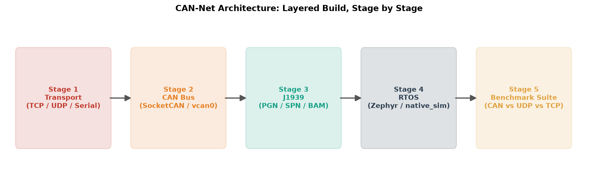
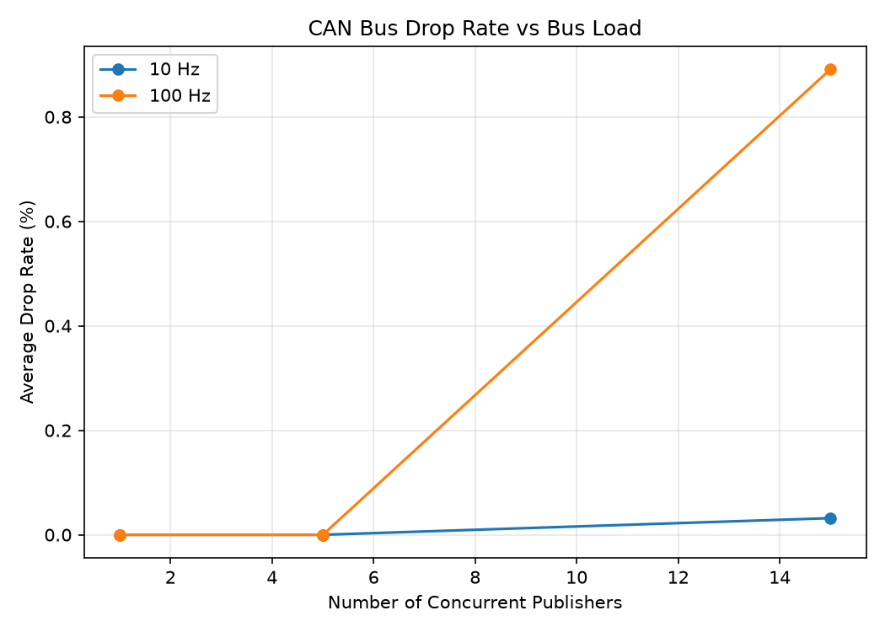
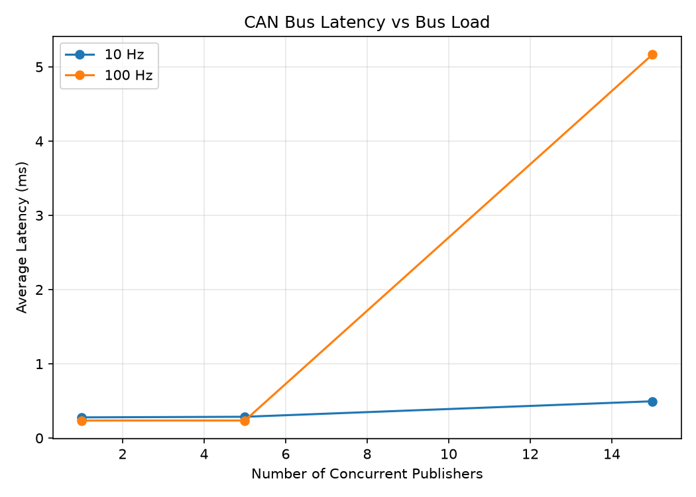
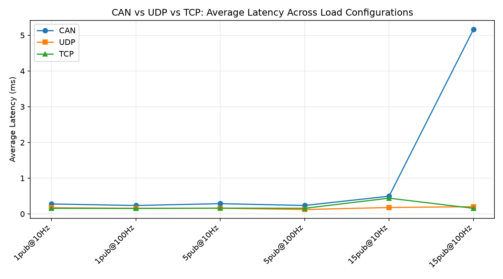

# CAN-Net: Embedded Networking & Real-Time CAN Bus Communication Stack

[](https://github.com/Asif-Ucchwas/can-net/actions/workflows/tests.yml)

A from-scratch, task-based build of an embedded networking stack — covering
general transport protocols, CAN bus fundamentals, the J1939 vehicle
protocol, RTOS integration, and a rigorous benchmark comparison — built
entirely in software/emulation (no physical hardware required).



## What This Project Demonstrates

| Layer | What's Covered |
|---|---|
| **Transport** | TCP framing, UDP unreliability, virtual serial links |
| **CAN Bus** | SocketCAN, kernel-level ID filtering, DBC encoding/decoding, bus arbitration |
| **J1939** | Real PGN/SPN signals, BAM multi-packet transport, diagnostics, multi-ECU stress test |
| **RTOS** | Zephyr under native_sim, bridged to real Linux CAN, verified preemption |
| **Benchmarking** | 360 total trials across CAN/UDP/TCP, honest analysis of results |

## Repo Structure

- stage1_networking/    TCP/UDP/Serial foundations + transport benchmark
- stage2_can/           SocketCAN, pub/sub with ID filtering, DBC + cantools
- stage3_j1939/         J1939 PGN/SPN encoding, BAM multi-packet transport, diagnostics
- stage4_rtos/          Zephyr RTOS app (preemption_demo/)
- stage5_benchmarking/  Full benchmark suite: test protocol, scripts, results, plots
- docs/                 RTOS scheduling parameter notes
- assets/               Architecture diagram + benchmark plots
- DEVLOG.md             Full running development log
- BENCHMARKS.md         Stage 1 transport benchmark results

Note on the Zephyr toolchain: zephyr_project/ (the Zephyr source tree + SDK,
~1GB+) and zephyr_venv/ (its Python virtual environment) are intentionally
not committed to this repo - they are fully reproducible via:
1. `python3 -m venv zephyr_venv && source zephyr_venv/bin/activate && pip install west`
2. `west init zephyr_project && cd zephyr_project && west update`
3. `pip install -r zephyr/scripts/requirements.txt` (required before the
   next step - west sdk install depends on packages declared here, e.g.
   patool, that aren't pulled in by installing west alone)
4. `west sdk install`

Only the custom application code in stage4_rtos/preemption_demo/ is
tracked.

## Benchmark Results

Full methodology in stage5_benchmarking/TEST_PROTOCOL.md.
Full comparison table in stage5_benchmarking/COMPARISON_RESULTS.md.

### Drop Rate vs Bus Load (CAN only)


### Latency vs Bus Load (CAN only)


### CAN vs UDP vs TCP - Latency Comparison


Key finding, with an important caveat: on this virtual setup, UDP and TCP
consistently outperformed CAN in both latency and drop rate under heavy load.
This reflects vcan0's software queue implementation in the Linux kernel -
NOT real CAN bus electrical arbitration. Real CAN hardware is chosen for
safety-critical systems specifically because of hardware-level deterministic,
bounded-worst-case-latency arbitration enforced by actual bit-timing on a
physical wire, which a virtual interface cannot replicate. Full discussion
in DEVLOG.md under Task 20.

## Environment

- WSL2 Ubuntu 24.04, Python 3.12.3
- SocketCAN (vcan0), python-can 4.6.1, cantools 42.0.3
- Zephyr RTOS (native_sim), Zephyr SDK 1.0.1
- Setup: pip install -r requirements.txt, then ./setup_vcan.sh to bring up
  the virtual CAN interface (needed once per session - it does not persist
  across restarts)

## Testing & Build

**Coverage:** 3 of 28 Python files are unit-tested (pytest, 35 tests) -
the pure J1939 protocol math (`j1939_ids.py` 74%, `j1939_signals.py`
77%, `j1939_bam.py` 66%). The remaining 25 files are live network/CAN
I/O scripts, verified instead via the 360-trial benchmark methodology
below rather than unit tests. Full honest breakdown in DEVLOG.md's
DevOps-Rigor coverage snapshot entry.

**Run tests:**
```bash
python3 -m venv .venv && source .venv/bin/activate
pip install -r requirements.txt -r requirements-dev.txt
pytest tests/ -v --cov=stage3_j1939 --cov-report=term-missing
```

**CI:** GitHub Actions runs the full test suite on every push/PR -
see `.github/workflows/tests.yml` (badge at the top of this README).

**Build clean (Zephyr/RTOS):**
```bash
python3 -m venv zephyr_venv && source zephyr_venv/bin/activate
pip install west
west init zephyr_project && cd zephyr_project && west update
pip install -r zephyr/scripts/requirements.txt  # required before sdk install
west sdk install
```
Verified end-to-end from a genuinely fresh install (system deps, venv,
Zephyr source tree, SDK) - see DEVLOG.md's Zephyr Build Audit entry.

## Development Log

This project keeps an honest, detailed running log of every task, every bug
hit, and every fix applied - see DEVLOG.md. It is written as genuine
engineering documentation, not a polished afterthought: real debugging
stories (a native_sim virtual-clock gotcha, a matplotlib headless backend
fix, a subtle Python string-replace bug) are documented as they happened.

## Status

Stages 1-5 complete (20/25 core tasks). Stage 6 (this README + paper draft)
in progress. Stage 7 (real hardware deployment) is optional and independent
of everything above - see DEVLOG.md for details.
